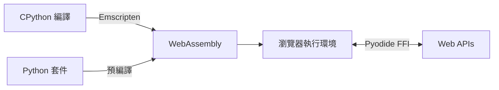
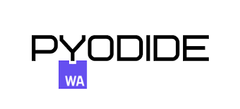
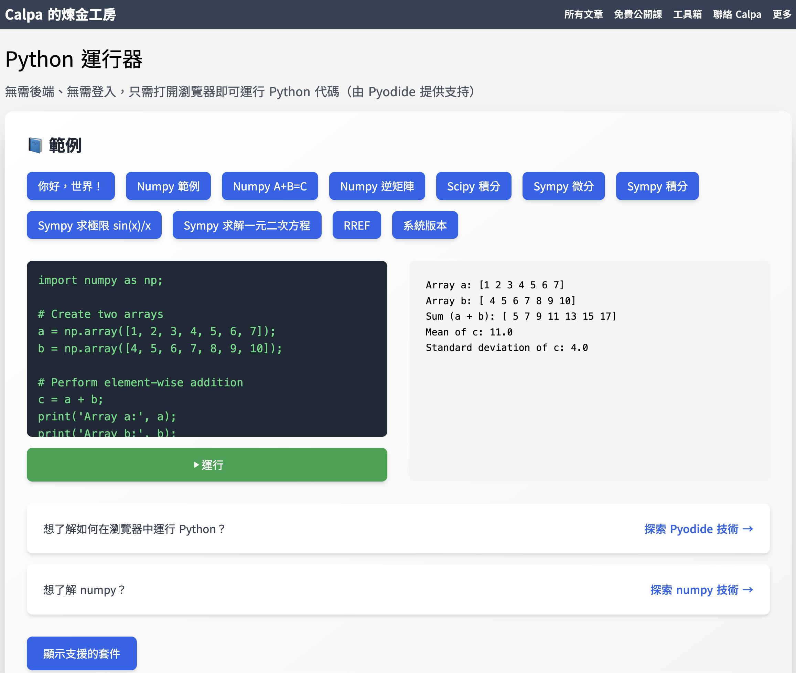
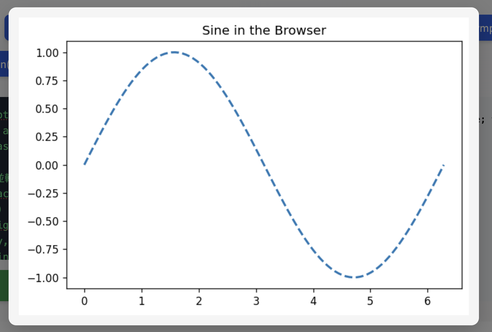
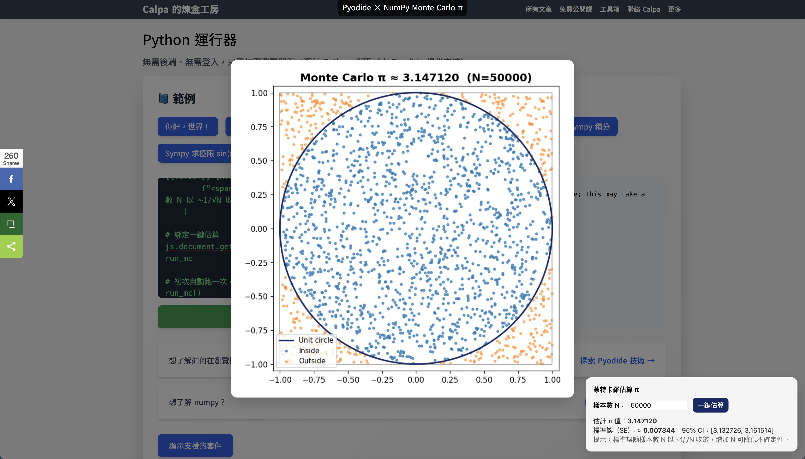

<LoadingScene />

---
layout: center
class: bg-[#172966] text-white font-mono
---

<div class="text-3xl text-center leading-snug">
  Running Python in the Browser<br /><small>Practical Applications with Pyodide</small>
</div>
<div class="text-xs opacity-50">2025-08-09 15:20 ~ 15:50 · COSCUP 2025 · RB105</div>
<div class="text-xs opacity-50">Calpa Liu</div>

---
layout: center
class: bg-[#172966] text-white font-mono
---

<div class="text-xl opacity-70 mb-2">你是不是也經歷過</div>

<div class="text-2xl sm:text-3xl font-bold leading-snug text-red-300">
  「想教學生/同事做數據分析，<br />但對方電腦沒裝 Python？」
</div>

<div class="text-2xl sm:text-3xl text-green-300 mt-6" v-click>
  今天，用 Pyodide 讓 <span class="font-bold">瀏覽器</span> 變成你的 Python 執行環境。
</div>

---
layout: two-cols
class: flex flex-col h-full justify-center items-center gap-4
---

## 投影片與 Demo

https://2025-08-09.calpa.me

<div class="text-xs opacity-80">現場 Demo（NumPy、JS ⟷ Python、Matplotlib、互動式蒙特卡羅估算 π）</div>

::right::


---
layout: two-cols
class: flex flex-col h-full justify-center items-center
---

## Nyahello，我是 Calpa

- 全端工程師，喜歡把複雜技術講到能落地
- 近年專注 AI × Web，實作多個瀏覽器端工具
- 每日寫作，偏好用工程化方法做內容與產品
- Blog: https://calpa.me/

::right::


<div class="text-xl font-bold mt-2">Calpa Liu</div>
<div class="text-sm opacity-70">Full‑stack · AI 工具開發 · 技術寫作者</div>

---
layout: two-cols
class: bg-[#172966] text-white font-mono flex flex-col h-full justify-center items-center
---

## Python

<div class="text-xl opacity-70 mb-2">非常適合數據分析的程式語言</div>

- **簡潔易學**
- **豐富的科學計算生態**： NumPy、Pandas、Matplotlib、Scikit-learn
- **自由開源**：Python 是一個自由開源的程式語言

::right::


---
layout: center
class: bg-[#172966] text-white font-mono
---

<div class="bg-white/80 dark:bg-white/10 rounded-lg p-6 text-base leading-relaxed shadow max-w-xl">
  <div class="text-2xl font-bold mb-4">阻礙：Python 在瀏覽器的困境</div>
  <ul class="list-disc list-inside space-y-1 text-base">
    <li><b>執行環境限制</b>：瀏覽器原生只支援 JavaScript</li>
    <li><b>效能瓶頸</b>：JavaScript 處理科學計算效能不足</li>
    <li><b>生態隔離</b>：Python 豐富的科學計算生態無法直接在網頁使用</li>
    <li><b>部署複雜</b>：需要後端伺服器支援 Python 執行環境</li>
      </ul>
      <div class="text-xs opacity-50 mt-3">FFI: Foreign Function Interface</div>
</div>

> **核心問題**：如何讓 Python 生態無縫整合到現代 Web 平台？

---
layout: two-cols
class: bg-[#172966] text-white font-mono flex flex-col h-full justify-center items-center
---

<div class="bg-white/80 dark:bg-white/10 rounded-lg p-6 text-base leading-relaxed shadow max-w-xl">
  <div class="text-2xl font-bold mb-4">技術突破：WASM + CPython</div>
  <ul class="list-disc list-inside space-y-1 text-base">
    <li><b>底層技術</b>：將 CPython 編譯為 WebAssembly</li>
    <li><b>效能優化</b>：接近原生的執行速度</li>
    <li><b>完整生態</b>：支援 NumPy、pandas 等科學計算套件</li>
        <li><b>無縫整合</b>：與 JavaScript 和 Web APIs 雙向互通</li>
      </ul>
      <div class="text-xs opacity-50 mt-3">FFI: Foreign Function Interface</div>
</div>

::right::




---
layout: center
---

<div class="flex flex-row md:flex-row items-center justify-center gap-8 w-full">
  <div class="bg-white/80 dark:bg-white/10 rounded-lg p-6 text-base leading-relaxed shadow max-w-xl">
    <div class="text-2xl font-bold mb-4 text-gray-900 dark:text-white">成果：Pyodide 誕生</div>
    <ul class="list-disc list-inside space-y-1 text-gray-800 dark:text-gray-100">
      <li><b>完整運行時</b>：在瀏覽器中運行標準 CPython</li>
      <li><b>科學計算</b>：原生支援 NumPy、SciPy、Matplotlib</li>
      <li><b>無縫整合</b>：與 JavaScript 互相調用</li>
      <li><b>零配置</b>：開箱即用，無需後端</li>
    </ul>
    <div class="mt-4 text-sm italic text-gray-500 dark:text-gray-300 border-l-4 border-gray-300 dark:border-gray-600 pl-3">
      <b>關鍵突破</b>：實現 Python 在瀏覽器中的完整科學計算能力
    </div>
    <div class="mt-6 text-xs text-gray-600 dark:text-gray-400">
      《Pyodide：在瀏覽器中運行 Python 的完整指南》【2025年3月29日】<br>
      <a href="https://calpa.me/blog/pyodide-run-python-in-browser/" class="text-blue-600 dark:text-blue-400 underline break-all">
        https://calpa.me/blog/pyodide-run-python-in-browser/
      </a>
    </div>
  </div>
  <div class="flex-shrink-0 flex flex-col items-center">
    
  </div>
</div>

---
layout: center
class: bg-[#172966] text-white font-mono
---

## 願景：Python 成為 Web 的「一等公民」

<div class="grid grid-cols-3 md:grid-cols-3 gap-8 mt-8">
  <div class="space-y-3 bg-white/80 dark:bg-white/10 rounded-xl shadow p-6" v-click>
    <div class="text-xl font-bold text-yellow-300">Web 的「一等公民」</div>
    <ul class="list-disc list-inside text-base mt-2 space-y-1">
      <li>與 JavaScript 平起平坐</li>
      <li>完整的開發者體驗</li>
      <li>靜態網站即可部署</li>
    </ul>
  </div>

  <div class="space-y-3 bg-white/80 dark:bg-white/10 rounded-xl shadow p-6" v-click>
    <div class="text-xl font-bold text-green-300">互補優勢</div>
    <ul class="list-disc list-inside text-base mt-2 space-y-1">
      <li><span class="font-semibold">UI/互動</span>：交給 <span class="font-semibold text-yellow-300">JavaScript</span></li>
      <li><span class="font-semibold">資料處理</span>：使用 Python 生態</li>
      <li><span class="font-semibold">科學計算</span>：強大的 <span class="font-semibold text-green-300">NumPy</span> / <span class="font-semibold text-green-300">pandas</span></li>
    </ul>
  </div>

  <div class="space-y-3 bg-white/80 dark:bg-white/10 rounded-xl shadow p-6" v-click>
    <div class="text-xl font-bold text-blue-300">直接價值</div>
    <ul class="list-disc list-inside text-base mt-2 space-y-1">
      <li><span class="font-semibold text-green-300">開箱即用</span></li>
      <li><span class="font-semibold text-green-300">離線</span>可用</li>
      <li>保護<span class="font-semibold text-green-300">資料隱私</span></li>
      <li>分發成本趨近於<span class="font-semibold text-green-300">零</span></li>
    </ul>
  </div>
</div>

<v-click>

> **未來展望**：讓 Python 成為 Web 開發的標準選項之一

</v-click>

---
layout: two-cols
class: bg-[#172966] text-white font-mono flex flex-col h-full justify-center items-center
---

<div class="bg-white/80 dark:bg-white/10 rounded-lg p-6 text-base leading-relaxed shadow max-w-xl">
  <div class="text-2xl font-bold mb-4">我的線上 Python REPL</div>
  <ul class="list-disc list-inside space-y-1 text-base">
    <li>開箱即用，無需登入/安裝</li>
    <li>完全在瀏覽器中執行 Python 3</li>
    <li>支援標準庫與熱門資料科學套件</li>
    <li>隨時隨地，有瀏覽器就能寫程式</li>
    <li><a href="https://calpa.me/tools/python-interpretor/">https://calpa.me/tools/python-interpretor/</a></li>
  </ul>
</div>

::right::



---
layout: center
---

## 五個 DEMO

---

## Live Demo 1：Python 呼叫 JS

```py
import js

# 建立按鈕
btn = js.document.createElement("button")
btn.textContent = "Click me"

# 設定 CSS 樣式
btn.style.position = "absolute"
btn.style.top = "0px"
btn.style.left = "0px"
btn.style.zIndex = "10000"  # 需要是字串
btn.style.background = "red"
btn.style.color = "white"
btn.style.padding = "8px 12px"
btn.style.border = "none"
btn.style.cursor = "pointer"

# 綁定點擊事件
btn.onclick = lambda event: js.alert("COSCUP 2025")

# 附加到頁面
js.document.body.append(btn)
```

---
layout: center
---

## Live Demo 2：運行 NumPy

```py
import numpy as np;
print(np.arange(12).reshape(3,4));
```

<v-click>
結果：
```py
[[ 0 1 2 3]
[ 4 5 6 7]
[ 8 9 10 11]]
```
</v-click>

---
layout: center
class: flex flex-col h-full justify-center
---

## Live Demo 3：Sympy 求解一元二次方程

$$
x^2 + 2x + 1 = 0
$$

<v-click>

```py
import sympy as sp

# 定義變數
x = sp.Symbol('x')

# 定義方程式
f = x**2 + 2*x + 1

# 求解根
roots = sp.solve(f, x)

print(f"The roots of f(x) are: {roots}")
```

</v-click>

---
layout: center
---

## Live Demo 4：利用 Matplotlib 在瀏覽器中繪製圖表



---

## Live Demo 4：利用 Matplotlib 在瀏覽器中繪製圖表

````md magic-move
```py
# 0) 前置準備
import matplotlib.pyplot as plt
import numpy as np
import io, base64, js
```

```py
# 1) 產生圖表並轉成 data URL
x = np.linspace(0, 2*np.pi, 100)
y = np.sin(x)
plt.figure(figsize=(6, 4), dpi=120)
plt.plot(x, y, '--', linewidth=2)
plt.title('Sine in the Browser')
plt.tight_layout()
buf = io.BytesIO()
plt.savefig(buf, format="png", bbox_inches="tight", facecolor="white")
buf.seek(0)
data_url = "data:image/png;base64," + base64.b64encode(buf.read()).decode("ascii")
plt.close()
```

```py
# 2) 頂端置中標籤
tag = js.document.createElement("div")
tag.textContent = "Pyodide × Matplotlib"
tag.style.cssText = (
    "position:absolute;top:0;left:50%;transform:translateX(-50%);z-index:10000;"
    "background:rgba(0,0,0,.7);color:#fff;padding:6px 10px;border-radius:0 0 8px 8px;"
)
js.document.body.append(tag)
```

```py
# 3) 灰色半透明遮罩 + 置中容器（無事件）
overlay = js.document.createElement("div")
overlay.style.cssText = (
    "position:fixed;inset:0;background:rgba(0,0,0,.5);display:flex;"
    "align-items:center;justify-content:center;z-index:9999;"
)
modal = js.document.createElement("div")
modal.style.cssText = (
    "background:#f5f5f5;padding:16px;border-radius:12px;"
    "box-shadow:0 10px 30px rgba(0,0,0,.2);max-width:95vw;max-height:80vh;"
)
img = js.document.createElement("img")
img.style.cssText = "max-width:90vw;max-height:70vh;display:block;"
img.src = data_url
img.alt = "Matplotlib Sine"
```

```py
# 4) 組裝
modal.append(img)
overlay.append(modal)
js.document.body.append(overlay)
```
````

https://gist.github.com/calpa/dec16701f05a7906b3bb34bfec888cc9

---

## Live Demo 5: 互動式蒙特卡羅估算 π



《用 ChatGPT + NumPy 互動模擬蒙特卡羅：一鍵估算 π 值與圖形化教學》【2025年4月21日】
https://calpa.me/blog/numpy-monte-carlo-pi-estimation-guide/

原始碼：
https://gist.github.com/calpa/32b7a96fd54954c5b3d5fc19ab70b343

---

## Pyodide vs Google Colab

<table class="min-w-full text-sm border border-gray-300 rounded-lg overflow-hidden my-6 shadow-sm">
  <thead>
    <tr class="bg-gray-100 text-black">
      <th class="px-4 py-2 font-semibold border-b border-gray-300 text-left">對比點</th>
      <th class="px-4 py-2 font-semibold border-b border-gray-300 text-left">Pyodide</th>
      <th class="px-4 py-2 font-semibold border-b border-gray-300 text-left">Google Colab</th>
    </tr>
  </thead>
  <tbody>
    <tr class="bg-white text-black">
      <td class="px-4 py-2 border-b border-gray-200">執行地點</td>
      <td class="px-4 py-2 border-b border-gray-200 font-semibold" style="color:#059669;">瀏覽器 (WASM)</td>
      <td class="px-4 py-2 border-b border-gray-200">雲端 VM</td>
    </tr>
    <tr class="bg-gray-50 text-black">
      <td class="px-4 py-2 border-b border-gray-200">登入/安裝</td>
      <td class="px-4 py-2 border-b border-gray-200">不需登入、零安裝</td>
      <td class="px-4 py-2 border-b border-gray-200">需 Google 帳號、後端初始化</td>
    </tr>
    <tr class="bg-white text-black">
      <td class="px-4 py-2 border-b border-gray-200">資料路徑</td>
      <td class="px-4 py-2 border-b border-gray-200">留在本機、隱私佳</td>
      <td class="px-4 py-2 border-b border-gray-200">上傳/掛載，合規考量</td>
    </tr>
    <tr class="bg-gray-50 text-black">
      <td class="px-4 py-2 border-b border-gray-200">JS 整合</td>
      <td class="px-4 py-2 border-b border-gray-200">JS ⟷ Python 原生互通</td>
      <td class="px-4 py-2 border-b border-gray-200">弱</td>
    </tr>
    <tr class="bg-white text-black">
      <td class="px-4 py-2 border-b border-gray-200">離線</td>
      <td class="px-4 py-2 border-b border-gray-200" style="color:#16a34a;">✅</td>
      <td class="px-4 py-2 border-b border-gray-200" style="color:#dc2626;">❌</td>
    </tr>
    <tr class="bg-gray-50 text-black">
      <td class="px-4 py-2 border-b border-gray-200">適合</td>
      <td class="px-4 py-2 border-b border-gray-200">教學、互動、Demo、PoC</td>
      <td class="px-4 py-2 border-b border-gray-200">分析、訓練、長時計算</td>
    </tr>
  </tbody>
</table>

> 結論：**不是替代關係**。Pyodide 擅長分發與互動，Colab 擅長重運算與研究。

---
layout: center
---

## Pyodide 能裝哪些套件？

- **核心科學計算**：NumPy, pandas, SciPy, Matplotlib, scikit-learn
- **機器學習**：xgboost, lightgbm, scikit-learn, gensim
- **資料視覺化**：Bokeh, Altair, Plotly (透過 orjson)
- **地理空間分析**：geopandas, rasterio, pyproj, cartopy
- **影像處理**：Pillow, opencv-python, scikit-image
- **自然語言處理**：nltk, spaCy (部分功能)
- **資料庫**：sqlalchemy, duckdb, pyarrow
- **遊戲開發**：pygame-ce, pyxel
- **其他實用工具**：requests, beautifulsoup4, lxml, pyyaml

> 💡 完整支援清單與版本請參考 [Pyodide 官方文件](https://pyodide.org/en/stable/usage/packages-in-pyodide.html)

---
layout: center
---

<div class="grid grid-cols-1 md:grid-cols-2 gap-8">
  <div class="bg-green-100 dark:bg-green-950 rounded-xl p-6 shadow">
    <div class="text-xl font-bold mb-2 text-green-700 dark:text-green-300">什麼時候用 Pyodide？</div>
    <ul class="list-disc list-inside space-y-1 text-base">
      <li>不想要求受眾安裝環境</li>
      <li>需要在地處理敏感資料</li>
      <li>想把 Python 與 Web UI 無縫結合</li>
      <li>需要離線教學/示範</li>
    </ul>
  </div>

  <div class="bg-red-100 dark:bg-red-950 rounded-xl p-6 shadow">
    <div class="text-xl font-bold mb-2 text-red-700 dark:text-red-300">什麼時候不要？</div>
    <ul class="list-disc list-inside space-y-1 text-base">
      <li>大型資料或長時間重運算</li>
      <li>需要大量 I/O、GPU/TPU</li>
      <li>嚴重依賴多進程/多線程的工作負載</li>
    </ul>
  </div>
</div>

---
layout: center
---

## 與生態的關係

- **JupyterLite**：基於 Pyodide 的瀏覽器內 Jupyter
- **PyScript**：偏向 Python 開發者的 HTML 標籤式體驗；與 Pyodide 擇一載入
- **PyodideU**（Stanford）：教學導向 IDE，示範更完整的同步暫停與調試思路

---
layout: two-cols
class: flex flex-col h-full justify-center
---

> 大道至簡：讓每個有想法的人，**言出法隨**。

歡迎交流：

- Email：**ai@calpa.me**
- Facebook：[@calpaliu2048](https://facebook.com/calpaliu2048)
- Threads：[@calpaliu2025](https://www.threads.net/@calpaliu2025)
- LINE：@calpaliu2023

<div class="text-sm text-white/50 mt-6">
若覺得今天實用，請分享給需要的人。謝謝收看！
</div>

::right::

<div class="flex flex-col items-center">


投影片地址：
https://2025-08-09.calpa.me

</div>
