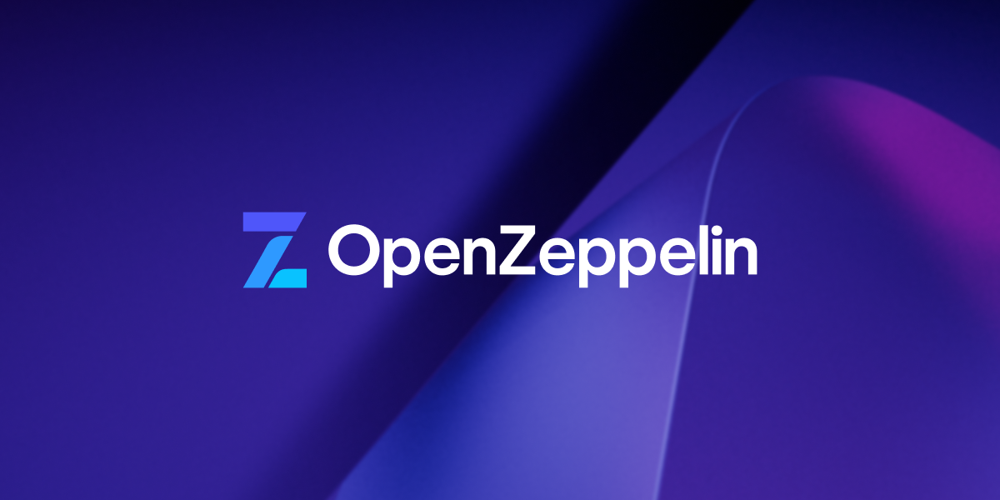

<LoadingScene />

---
layout: center
class: bg-[#172966] text-white font-mono
---

<div class="text-3xl text-center leading-snug">
  用 AI 寫智能合約<br /><small>從 Perplexity 到 Solidity 實作</small>
</div>
<div class="text-xs opacity-50">2025-08-19 · Solidity 新手場 · Calpa</div>

---
layout: center
class: bg-[#172966] text-white font-mono
---

<div class="text-xl opacity-70 mb-2">你是不是也經歷過</div>

<div class="text-2xl sm:text-3xl font-bold leading-snug text-red-300">
  「想寫智能合約，<br />卻不知道從哪開始？」
</div>

<div class="text-2xl sm:text-3xl text-green-300 mt-6" v-click>
  今天，用 Perplexity + ChatGPT，<br />帶你從 0 到 1 完成合約開發。
</div>

---
layout: center
---

## OpenZeppelin 是什麼？

OpenZeppelin 是一套經過安全審核、開源的智能合約函式庫，
廣泛應用於 DeFi、NFT 與 DAO 領域。

<div class="grid grid-cols-1 md:grid-cols-2 gap-8 mt-8">
  <div class="space-y-3 bg-white/80 dark:bg-white/10 rounded-xl shadow p-6">
    <div class="text-xl font-bold text-green-300">功能特色</div>
    <ul class="list-disc list-inside space-y-1 text-base">
      <li>內建 ERC20、ERC721、AccessControl 等標準模組</li>
      <li>安全性高：廣泛社群使用並經多次審計</li>
      <li>模組化：可自由組合擴充功能</li>
      <li>支援最新 Solidity 版本與工具鏈</li>
    </ul>
  </div>
  
  <div class="flex flex-col items-center">
    
    <div class="text-sm text-gray-400 mt-2">圖片來源：OpenZeppelin GitHub</div>
  </div>
</div>

<v-click>

> 官方網站：[openzeppelin.com](https://www.openzeppelin.com/)

</v-click>

---
layout: center
---

## 核心理念

與其學語法，我們今天學的是：

> **如何問對問題，讓 AI 幫你寫出正確的合約。**

---
layout: center
---

## Prompt 1：永久訊息合約

🎯 目標：部署一個合約，儲存並更新文字訊息

🧠 Prompt 結構：
```
請寫一份能讓用戶儲存並更新一段文字訊息的 Ethereum 智能合約。
```

🔧 提示：
- 適合初學者入門
- 可搭配 Remix 測試

---
layout: center
---

## Prompt 2：ERC20 發幣合約

🎯 目標：發行一個自訂代幣，並具備增發與銷毀功能

🧠 Prompt 結構：
```
你是一位 Solidity 智能合約開發專家。
請幫我生成一份符合 ERC20 標準的代幣合約，
使用 openzeppelin v5，名稱為 ExampleToken，
代號為 EXT，初始供應量為 10,000 枚，
合約擁有者可增發和銷毀代幣。
請加入詳細英文註解。
```

🔧 提示：
- 可用於理解 OpenZeppelin 套件架構
- 記得確認 Ownable 初始設定（v5 需要手動）

---
layout: center
---

## Prompt 3：投票合約

🎯 目標：建立一個每人僅能投一次票的投票系統

🧠 Prompt 結構：
```
你是一位 Solidity 智能合約開發專家。
請幫我生成一份簡單投票的智能合約，
每次部署即是一個新投票，題目與選項固定，
參與者每人僅能投一次票，並可查詢各選項票數。
請使用 Solidity v0.8 以上版本，加上詳細英文註解，結構明確易懂。
```

🔧 提示：
- 適合搭配前端介面展示投票行為

---
layout: center
---

## Prompt 4：重入攻擊（Reentrancy）範例

🎯 目標：學會如何用 AI 生成具漏洞的合約並解釋風險

🧠 Prompt 結構：
```
請生成一份包含重入攻擊漏洞的提領合約，
並說明問題所在，建議如何修正。
```

🔧 提示：
- 可請 AI 加入 `Checks-Effects-Interactions` 解法
- 可詢問如何用 `ReentrancyGuard` 實作防禦

---
layout: center
---

## AI 輔助寫合約的黃金技巧

- 角色扮演：指定「你是一位 Solidity 專家」
- 清楚目標：描述功能與條件
- 範圍控制：告訴 AI 使用版本、函式庫等限制
- 註解要求：提升可讀性

---
layout: center
---

## 延伸學習路線

- 多用 Perplexity 查找合約範例與討論串
- 把 prompt 存下來，調整重用（建立 Prompt Library）
- 試著讓 AI 幫你 debug 錯誤與優化安全性

---
layout: center
---

## 結語

今天不是學 Solidity，而是學會：

> 「怎麼精準地問問題，讓 AI 成為你的合約寫手。」

---
layout: center
---

## Contact

- Blog：https://calpa.me/
- Email：**ai@calpa.me**
- Threads / FB / LINE：@calpaliu2025

> 如果覺得實用，歡迎轉發與討論 🙌
