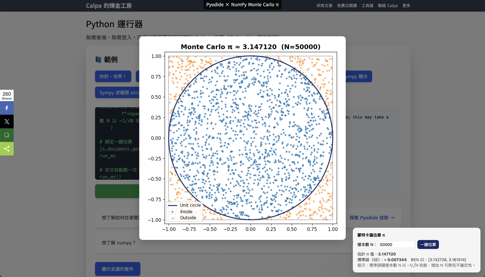

<LoadingScene />

---
layout: center
---

<div class="text-3xl text-center leading-snug">
  Pyodide: Python Reborn in the Browser
</div>
<div class="text-xs opacity-50">Saturday, October 11, 2025 · 11:30 AM</div>
<div class="text-xs opacity-50">Track B (LT-14) · PyCon Hong Kong 2025</div>
<div class="text-xs opacity-50">Calpa Liu</div>
---
layout: center
class: bg-[#172966] text-white font-mono
---

<div class="text-xl opacity-70 mb-2">Have you ever wished you could run Python directly in the browser?</div>

<div class="text-2xl sm:text-3xl font-bold leading-snug text-red-300">
  Without any server backend or WebSocket setup?
</div>

<div class="text-2xl sm:text-3xl text-green-300 mt-6" v-click>
  Today, <span class="font-bold">Pyodide</span> brings the full Python runtime to your <span class="font-bold">browser</span>.
</div>

---
layout: two-cols
class: flex flex-col h-full justify-center items-center gap-4
---

## Slides & Demos

https://2025-10-11.calpa.me

<div class="text-xs opacity-80">Live demos (NumPy, JS ⟷ Python, Matplotlib, interactive Monte Carlo π estimation)</div>

::right::

<QRCode value="https://2025-10-11.calpa.me" :size="200" class="mt-6 mx-auto" />

---
layout: two-cols
class: flex flex-col h-full justify-center items-center
---

## Nyahello, I'm Calpa

- Full-stack engineer & independent educator
- Specialize in frontend development and interactive web technologies
- Actively exploring Pyodide to teach scientific computing in browser
- Active speaker in AI × developer tooling space
- Blog: https://calpa.me/

::right::


<div class="text-xl font-bold mt-2">Calpa Liu</div>
<div class="text-sm opacity-70">Full‑stack Engineer · Independent Educator · AI Tooling</div>

---
layout: two-cols
class: bg-[#172966] text-white font-mono flex flex-col h-full justify-center items-center
---

## Python

<div class="text-xl opacity-70 mb-2">Perfect language for data analysis</div>

- **Simple and easy to learn**
- **Rich scientific computing ecosystem**: NumPy, Pandas, Matplotlib, Scikit-learn
- **Free and open source**: Python is a free and open-source programming language

::right::


---
layout: center
class: bg-[#172966] text-white font-mono
---

<div class="bg-white/80 dark:bg-white/10 rounded-lg p-6 text-base leading-relaxed shadow max-w-xl">
  <div class="text-2xl font-bold mb-4">Challenge: Python's Browser Dilemma</div>
  <ul class="list-disc list-inside space-y-1 text-base">
    <li><b>Runtime Limitation</b>: Browsers natively only support JavaScript</li>
    <li><b>Performance Bottleneck</b>: JavaScript lacks performance for scientific computing</li>
    <li><b>Ecosystem Isolation</b>: Python's rich scientific computing ecosystem can't be used directly in web</li>
    <li><b>Complex Deployment</b>: Requires backend server to support Python runtime</li>
      </ul>
      <div class="text-xs opacity-50 mt-3">FFI: Foreign Function Interface</div>
</div>

> **Core Question**: How to run Python directly in the browser without any server backend?

---
layout: two-cols
class: bg-[#172966] text-white font-mono flex flex-col h-full justify-center items-center
---

<div class="bg-white/80 dark:bg-white/10 rounded-lg p-6 text-base leading-relaxed shadow max-w-xl">
  <div class="text-2xl font-bold mb-4">Technical Breakthrough: WASM + CPython</div>
  <ul class="list-disc list-inside space-y-1 text-base">
    <li><b>Core Technology</b>: Compile CPython to WebAssembly</li>
    <li><b>Performance Optimization</b>: Near-native execution speed</li>
    <li><b>Complete Ecosystem</b>: Support NumPy, pandas and other scientific packages</li>
        <li><b>Seamless Integration</b>: Bidirectional communication with JavaScript and Web APIs</li>
      </ul>
      <div class="text-xs opacity-50 mt-3">FFI: Foreign Function Interface</div>
</div>

::right::


---
layout: center
---

<div class="flex flex-row md:flex-row items-center justify-center gap-8 w-full">
  <div class="bg-white/80 dark:bg-white/10 rounded-lg p-6 text-base leading-relaxed shadow max-w-xl">
    <div class="text-2xl font-bold mb-4 text-gray-900 dark:text-white">Result: Pyodide is Born</div>
    <ul class="list-disc list-inside space-y-1 text-gray-800 dark:text-gray-100">
      <li><b>Complete Runtime</b>: Run standard CPython in browser</li>
      <li><b>Scientific Computing</b>: Native support for NumPy, SciPy, Matplotlib</li>
      <li><b>Seamless Integration</b>: Mutual invocation with JavaScript</li>
      <li><b>Zero Configuration</b>: Ready to use, no backend needed</li>
    </ul>
    <div class="mt-4 text-sm italic text-gray-500 dark:text-gray-300 border-l-4 border-gray-300 dark:border-gray-600 pl-3">
      <b>Key Breakthrough</b>: Achieve complete scientific computing capability for Python in browser
    </div>
    <div class="mt-6 text-xs text-gray-600 dark:text-gray-400">
      "Pyodide: Complete Guide to Running Python in Browser" [March 29, 2025]<br>
      <a href="https://calpa.me/blog/pyodide-run-python-in-browser/" class="text-blue-600 dark:text-blue-400 underline break-all">
        https://calpa.me/blog/pyodide-run-python-in-browser/
      </a>
    </div>
  </div>
  <div class="flex-shrink-0 flex flex-col items-center">
    
  </div>
</div>

---
layout: center
class: bg-[#172966] text-white font-mono
---

## What Pyodide Opens Up

<div class="grid grid-cols-3 md:grid-cols-3 gap-8 mt-8">
  <div class="space-y-3 bg-white/80 dark:bg-white/10 rounded-xl shadow p-6" v-click>
    <div class="text-xl font-bold text-yellow-300">No-Backend Playgrounds</div>
    <ul class="list-disc list-inside text-base mt-2 space-y-1">
      <li>Interactive Python REPL</li>
      <li>Educational notebooks</li>
      <li>Static site deployment</li>
    </ul>
  </div>

  <div class="space-y-3 bg-white/80 dark:bg-white/10 rounded-xl shadow p-6" v-click>
    <div class="text-xl font-bold text-green-300">AI-Enabled Tools</div>
    <ul class="list-disc list-inside text-base mt-2 space-y-1">
      <li><span class="font-semibold">Model Inference</span>: Run AI models client-side</li>
      <li><span class="font-semibold">Data Processing</span>: NumPy, pandas in browser</li>
      <li><span class="font-semibold">Scientific Viz</span>: Matplotlib, Plotly charts</li>
    </ul>
  </div>

  <div class="space-y-3 bg-white/80 dark:bg-white/10 rounded-xl shadow p-6" v-click>
    <div class="text-xl font-bold text-blue-300">Offline-Capable Apps</div>
    <ul class="list-disc list-inside text-base mt-2 space-y-1">
      <li><span class="font-semibold text-green-300">Privacy-first</span>: Data stays local</li>
      <li><span class="font-semibold text-green-300">Offline</span> ready</li>
      <li><span class="font-semibold text-green-300">Zero</span> backend cost</li>
    </ul>
  </div>
</div>

<v-click>

> **New Doors**: Pyodide opens new possibilities for Python in the frontend

</v-click>

---
layout: two-cols
class: bg-[#172966] text-white font-mono flex flex-col h-full justify-center items-center
---

<div class="bg-white/80 dark:bg-white/10 rounded-lg p-6 text-base leading-relaxed shadow max-w-xl">
  <div class="text-2xl font-bold mb-4">Python REPL</div>
  <ul class="list-disc list-inside space-y-1 text-base">
    <li>Ready to use, no login/installation required</li>
    <li>Fully execute Python 3 in browser</li>
    <li>Support standard library and popular data science packages</li>
    <li>Anytime, anywhere, code with just a browser</li>
    <li>Chrome browser recommended</li>
    
    <a href="https://calpa.me/tools/python-interpretor/">https://calpa.me/tools/python-interpretor/</a>
  </ul>
</div>

::right::


---
layout: center
---

## Five Demos

---

## Live Demo 1: Python Calling JS

```py
import js

# Create button
btn = js.document.createElement("button")
btn.textContent = "Click me"

# Set CSS styles
btn.style.position = "absolute"
btn.style.top = "0px"
btn.style.left = "0px"
btn.style.zIndex = "10000"  # Must be string
btn.style.background = "red"
btn.style.color = "white"
btn.style.padding = "8px 12px"
btn.style.border = "none"
btn.style.cursor = "pointer"

# Bind click event
btn.onclick = lambda event: js.alert("PyCon HK 2025")

# Append to page
js.document.body.append(btn)
```

---
layout: center
---

## Live Demo 2: Running NumPy

```py
import numpy as np;
print(np.arange(12).reshape(3,4));
```

<v-click>
Result:

````py
[[ 0 1 2 3]
[ 4 5 6 7]
[ 8 9 10 11]]
````

</v-click>

---
layout: center
class: flex flex-col h-full justify-center
---

## Live Demo 3: Solving Quadratic Equation with Sympy

$$
x^2 + 2x + 1 = 0
$$

<v-click>

```py
import sympy as sp

# Define variable
x = sp.Symbol('x')

# Define equation
f = x**2 + 2*x + 1

# Solve for roots
roots = sp.solve(f, x)

print(f"The roots of f(x) are: {roots}")
```

</v-click>

---
layout: center
---

## Live Demo 4: Drawing Charts in Browser with Matplotlib


---

## Live Demo 4: Drawing Charts in Browser with Matplotlib

````md magic-move
```py
# 0) Setup
import matplotlib.pyplot as plt
import numpy as np
import io, base64, js
```

```py
# 1) Generate chart and convert to data URL
x = np.linspace(0, 2*np.pi, 100)
y = np.sin(x)
plt.figure(figsize=(6, 4), dpi=120)
plt.plot(x, y, '--', linewidth=2)
plt.title('Sine in the Browser')
plt.tight_layout()
buf = io.BytesIO()
plt.savefig(buf, format="png", bbox_inches="tight", facecolor="white")
buf.seek(0)
data_url = "data:image/png;base64," + base64.b64encode(buf.read()).decode("ascii")
plt.close()
```

```py
# 2) Top centered label
tag = js.document.createElement("div")
tag.textContent = "Pyodide × Matplotlib"
tag.style.cssText = (
    "position:absolute;top:0;left:50%;transform:translateX(-50%);z-index:10000;"
    "background:rgba(0,0,0,.7);color:#fff;padding:6px 10px;border-radius:0 0 8px 8px;"
)
js.document.body.append(tag)
```

```py
# 3) Gray semi-transparent overlay + centered container (no events)
overlay = js.document.createElement("div")
overlay.style.cssText = (
    "position:fixed;inset:0;background:rgba(0,0,0,.5);display:flex;"
    "align-items:center;justify-content:center;z-index:9999;"
)
modal = js.document.createElement("div")
modal.style.cssText = (
    "background:#f5f5f5;padding:16px;border-radius:12px;"
    "box-shadow:0 10px 30px rgba(0,0,0,.2);max-width:95vw;max-height:80vh;"
)
img = js.document.createElement("img")
img.style.cssText = "max-width:90vw;max-height:70vh;display:block;"
img.src = data_url
img.alt = "Matplotlib Sine"
```

```py
# 4) Assemble
modal.append(img)
overlay.append(modal)
js.document.body.append(overlay)
```
````

https://gist.github.com/calpa/dec16701f05a7906b3bb34bfec888cc9

---

## Live Demo 5: Interactive Monte Carlo π Estimation



"Interactive Monte Carlo Simulation with ChatGPT + NumPy: One-Click π Estimation & Visual Teaching" [April 21, 2025]
https://calpa.me/blog/numpy-monte-carlo-pi-estimation-guide/

Source code:
https://gist.github.com/calpa/32b7a96fd54954c5b3d5fc19ab70b343

---

## Pyodide vs Google Colab

<table class="min-w-full text-sm border border-gray-300 rounded-lg overflow-hidden my-6 shadow-sm">
  <thead>
    <tr class="bg-gray-100 text-black">
      <th class="px-4 py-2 font-semibold border-b border-gray-300 text-left">Comparison</th>
      <th class="px-4 py-2 font-semibold border-b border-gray-300 text-left">Pyodide</th>
      <th class="px-4 py-2 font-semibold border-b border-gray-300 text-left">Google Colab</th>
    </tr>
  </thead>
  <tbody>
    <tr class="bg-white text-black">
      <td class="px-4 py-2 border-b border-gray-200">Execution Location</td>
      <td class="px-4 py-2 border-b border-gray-200 font-semibold" style="color:#059669;">Browser (WASM)</td>
      <td class="px-4 py-2 border-b border-gray-200">Cloud VM</td>
    </tr>
    <tr class="bg-gray-50 text-black">
      <td class="px-4 py-2 border-b border-gray-200">Login/Installation</td>
      <td class="px-4 py-2 border-b border-gray-200">No login, zero install</td>
      <td class="px-4 py-2 border-b border-gray-200">Requires Google account, backend init</td>
    </tr>
    <tr class="bg-white text-black">
      <td class="px-4 py-2 border-b border-gray-200">Data Path</td>
      <td class="px-4 py-2 border-b border-gray-200">Stays local, privacy-friendly</td>
      <td class="px-4 py-2 border-b border-gray-200">Upload/mount, compliance concerns</td>
    </tr>
    <tr class="bg-gray-50 text-black">
      <td class="px-4 py-2 border-b border-gray-200">JS Integration</td>
      <td class="px-4 py-2 border-b border-gray-200">JS ⟷ Python native interop</td>
      <td class="px-4 py-2 border-b border-gray-200">Weak</td>
    </tr>
    <tr class="bg-white text-black">
      <td class="px-4 py-2 border-b border-gray-200">Offline</td>
      <td class="px-4 py-2 border-b border-gray-200" style="color:#16a34a;">✅</td>
      <td class="px-4 py-2 border-b border-gray-200" style="color:#dc2626;">❌</td>
    </tr>
    <tr class="bg-gray-50 text-black">
      <td class="px-4 py-2 border-b border-gray-200">Best For</td>
      <td class="px-4 py-2 border-b border-gray-200">Teaching, interaction, demos, PoC</td>
      <td class="px-4 py-2 border-b border-gray-200">Analysis, training, long computation</td>
    </tr>
  </tbody>
</table>

> Conclusion: **Not a replacement**. Pyodide excels at distribution & interaction, Colab excels at heavy computation & research.

---
layout: center
---

## What Packages Can Pyodide Install?

- **Core Scientific Computing**: NumPy, pandas, SciPy, Matplotlib, scikit-learn
- **Machine Learning**: xgboost, lightgbm, scikit-learn, gensim
- **Data Visualization**: Bokeh, Altair, Plotly (via orjson)
- **Geospatial Analysis**: geopandas, rasterio, pyproj, cartopy
- **Image Processing**: Pillow, opencv-python, scikit-image
- **Natural Language Processing**: nltk, spaCy (partial features)
- **Databases**: sqlalchemy, duckdb, pyarrow
- **Game Development**: pygame-ce, pyxel
- **Other Utilities**: requests, beautifulsoup4, lxml, pyyaml

> 💡 For complete support list and versions, refer to [Pyodide official documentation](https://pyodide.org/en/stable/usage/packages-in-pyodide.html)

---
layout: center
---

<div class="grid grid-cols-1 md:grid-cols-2 gap-8">
  <div class="bg-green-100 dark:bg-green-950 rounded-xl p-6 shadow">
    <div class="text-xl font-bold mb-2 text-green-700 dark:text-green-300">When to Use Pyodide?</div>
    <ul class="list-disc list-inside space-y-1 text-base">
      <li>Don't want to require audience to install environment</li>
      <li>Need to process sensitive data locally</li>
      <li>Want to seamlessly integrate Python with Web UI</li>
      <li>Need offline teaching/demos</li>
    </ul>
  </div>

  <div class="bg-red-100 dark:bg-red-950 rounded-xl p-6 shadow">
    <div class="text-xl font-bold mb-2 text-red-700 dark:text-red-300">When Not to Use?</div>
    <ul class="list-disc list-inside space-y-1 text-base">
      <li>Large data or long-running heavy computation</li>
      <li>Need heavy I/O, GPU/TPU</li>
      <li>Heavily dependent on multi-process/multi-threading workloads</li>
    </ul>
  </div>
</div>

---
layout: center
---

## Relationship with Ecosystem

- **JupyterLite**: Browser-based Jupyter built on Pyodide
- **PyScript**: HTML tag-style experience for Python developers; choose between it and Pyodide
- **PyodideU** (Stanford): Teaching-oriented IDE, demonstrates more complete synchronous pause and debugging approach

---
layout: two-cols
class: flex flex-col h-full justify-center
---

> The great way is simple: Let everyone with ideas **make it happen**.

Welcome to connect:

- Email: **ai@calpa.me**
- Facebook: [@calpaliu2048](https://facebook.com/calpaliu2048)
- Threads: [@calpaliu2025](https://www.threads.net/@calpaliu2025)
- LINE: @calpaliu2023

<div class="text-sm text-white/50 mt-6">
If you found this useful today, please share with those who need it. Thank you!
</div>

::right::

<div class="flex flex-col items-center">

<QRCode value="https://2025-10-11.calpa.me" :size="200" class="mt-6 mx-auto" />

Slides URL:
https://2025-10-11.calpa.me

</div>
